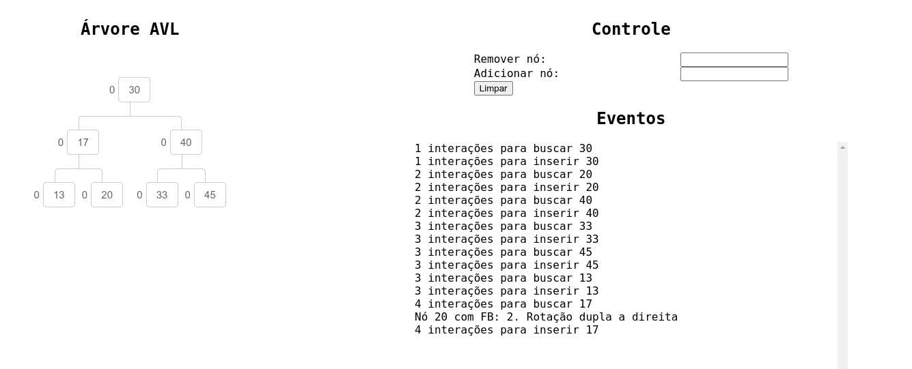

# AVL

Árvore AVL consite em um tipo de árvore binária, onde cada nó armazena também a um fator de balanceamento.
Esse fator pode ser descrito por $BF(n) = h(n_e) - h(n_d)$, sendo $h(n)$ a altura da árvore $n$, $n_e$ a árvore a esquerda e $n_d$ a árvore a direita.

## Uso

Clonar o repositório
```shell
https://github.com/gabrielmusskopf/avl.git
```
Build e start
```shell
make start
```

ou, usar imagem do Dockerhub
```shell
 docker pull gabrielmusskopf/avl:latest
 docker run -p 3333:3333 -it gabrielmusskopf/avl:latest
```

O projeto é orientado a linha de comando, tendo as funcionalidades de:
- Ver árvore
- Inserir nó
- Inserir nós
- Buscar nó
- Remover nó
- DFS post order
- DFS pre order
- DFS in order
- BFS
- debug

A opção de debug consiste em exibir no terminal algumas informações sobre o que a árvore está fazendo a cada operação, como rotações e número de interações


Além da intereção via linha de comando, é possível iniciar um servidor HTTP para visualizar e interagir com a árvore pelo navegador em `http://localhost:3333`




Caso queira somente o servidor HTTP, é possível com
```shell
make start-http
```

ou, com Docker
```
docker run -p 3333:3333 -it gabrielmusskopf/avl:latest -http
```

## AVL indexada
A aplicação conta com uma árvore AVL indexada para criar índices para buscas com a complexidade temporal de uma árvore binária de busca. A árvore `IndexedTree` é constituída de 
uma chave (index) e um valor. 

O valor é uma referência para o tipo de informação que a árvore deve indexar, como referência para um inteiro, string, struct, etc. A chave é um tipo
personalizado que deve implementar os métodos definidos na interface `Ordered[T any]` de comparação para as operações na árvore
